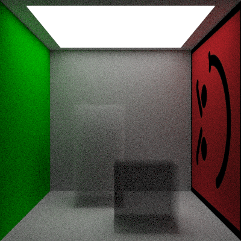

| branch | travis | appveyor |
| :---: | :---: | :---: |
| master |  |  |
| develop |  |  |
| all ||  |

# Raytracing in One Weekend and beyond

## 1.0.0

Image info:
- Cornell Box with volumes and textures
- Total rendering time 216s (on windows)
- Samples per pixel 128
- Image resolution 400x400 px
- Single thread / SIMD instruction

> In the current image, with the current sample count, will be extremely diffucult to identify metal from lambert materials, but with a higher (and most reasonable) sample count, let's say 128 or even 64, the total amount of rays generated will be 1.966.080.000, almost 2 Billion (128 sample, with 64 will be 1 Billion), and for a single threaded application this may be a little overkill.

## References
- [Raytracing in a Weekend](http://amzn.eu/3JyrhOX)
